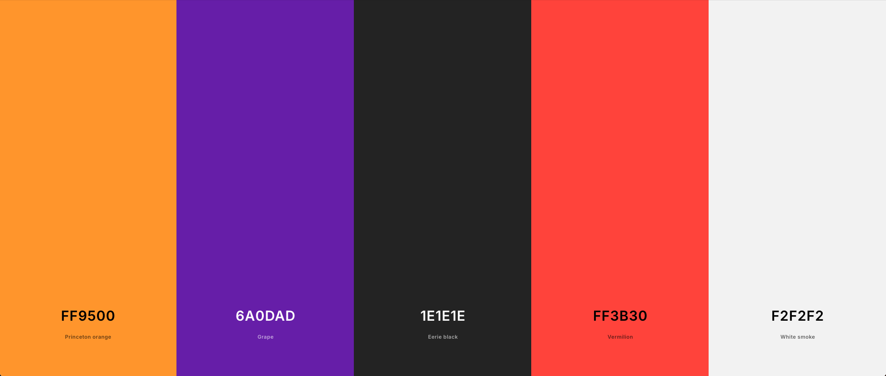
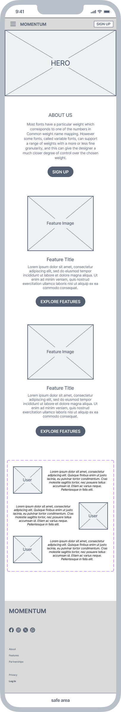
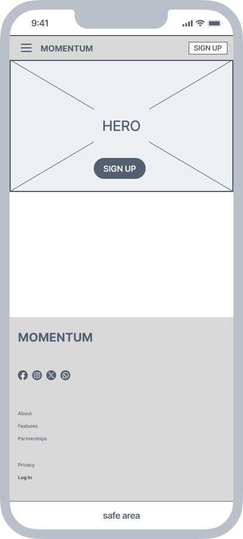
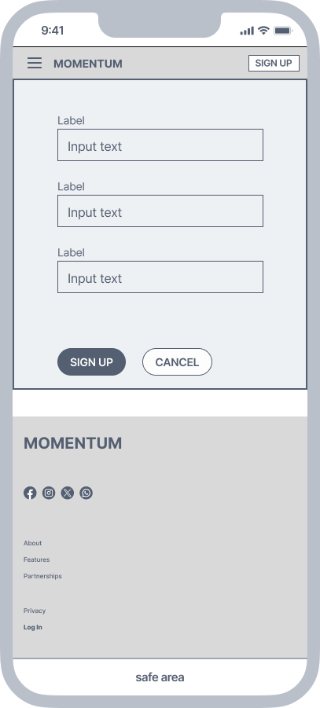
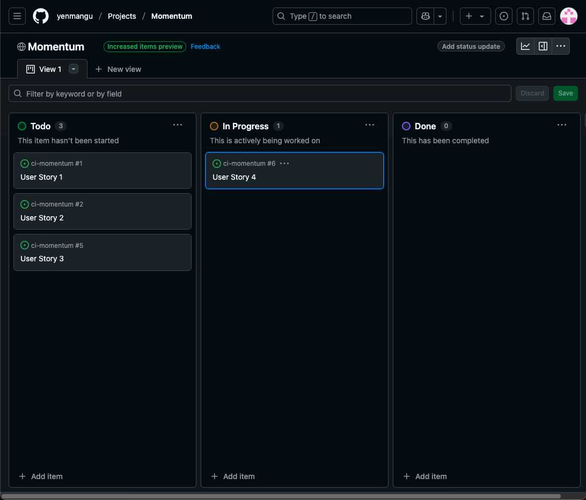

# Momentum

Momentum is a fitness-focused platform designed to support users at any stage of their fitness journey — whether you're just getting started or already committed to an active lifestyle. Our goal is to provide the tools, guidance, and motivation needed to help you stay consistent and make progress at your own pace. From personalized workout plans to expert tips, Momentum is built to keep you moving forward.

The website described here is a signup page for both types of user, to register interest to the main platform.

**Mockup here**

<!-- Mockup here -->

---

## User Experience

<!-- UX here -->

## UX

### UX Overview

This platform is meant to attract two types of users.

**Primary User** -
users of any age and background, who share a common goal of wanting to stay on track with their fitness goals.

**Secondary User** -
any existing fitness organisation/gym owner who currently doesn't but wishes to offer fitness or goal tracking services to existing customers.

There is clear navigation for both types of User, designed to clearly guide the user towards the appropriate section.

Users can directly contact Momentum if they wish to work with us as we are always looking for new talent to join our growing family.

### The 5 Planes of UX

#### 1. Strategy Plane
##### Purpose
- Advertise and introduce the App to new Users
- Provide a sign up service to new Users for the App
- Provide information to Users about the App and the services it provides.

##### Business Goals
- New Users signing up to the Momentum App
- Return business from User Subscription to the Momentum App

##### Primary User Needs
- Registration forms
- Details of the services the Momentum platform will provide
- Information on how to start getting into fitness
- Links to fitness articles (this could provide SEO opportunities with back linking)

#### 2. Scope Plane
##### Features
- A full list of [Features](#features-1) can be viewed in detail below.

##### Content Requirements
- Clear, motivational text about the Momentum platform's mission.
- Photos showcasing the platform
- Descriptions of platform features.
- Forms for User sign-up.

#### 3. Structure Plane
##### Information Architecture
- **Navigation Menu**:
  - Accessible links in the navbar.
- **Hierarchy**:
  - Clear call-to-action buttons.
  - Prominent placement of social media links in the footer.

##### User Flow
1. User lands on the home page → learns about the Momentum platform's mission.
2. Navigates to the fitness user page → learns about the Momentum plaform's features.
3. Signs up via the sign-up page.

#### 4. Skeleton Plane
##### Wireframe Suggestions
- A full list of [Wireframes](#wireframes) can be viewed in detail below.

#### 5. Surface Plane
##### Visual Design Elements
- **[Colours](#colour-scheme)**: see below
- **[Typography](#typography)**: see below

### Colour Scheme

I used [coolors.co](https://coolors.co/6a0dad-ff3b30-1e1e1e-f2f2f2-ff9500) to generate my color palette.

- `rgb(224,131,0)` / `#FF9500` Primary.
- `rgb(106, 13, 173)` / `#6A0DAD` Primary highlights & secondary text.
- `rgb(30,30,30)` / `#1E1E1E` Primary text.
- `rgb(235,235,235)` / `#F2F2f2` Background and tertiary.
- `rgb(255,59,48)` / `#FF3B30` Secondary highlights.

Other colours used
-`` / `#`

### Typography

- [Chakra Petch](https://fonts.google.com/specimen/Chakra+Petch) Was used for the logo typeface, and main header.
- [Montserrat](https://fonts.google.com/specimen/Montserrat) was used for the secondary headers and text body.
- [Font Awesome](https://fontawesome.com) icons were used throughout the site, such as the social media icons in the footer.

## User Stories

| Target    | Expectation                                                                                   | Outcome                                                                                 |
| --------- | --------------------------------------------------------------------------------------------- | --------------------------------------------------------------------------------------- |
| As a user | I would like to know more about the platform                                                  | so that I can start my fitness journey                                                  |
| As a user | I would like information on a fitness tracking system                                         | so that I can monitor my fitness journey.                                               |
| As a user | I would like to see the details of a fitness platform features                                | so that I can choose my fitness app accordingly                                         |
| As a user | I would like to view a gallery of images from a fitness platform                              | so that I can see examples of the fitness platform will look.                           |
| As a user | I would like to sign up for a fitness platform                                                | so that I can use the app and enjoy its benefits.                                       |
| As a user | I would like to follow the platform on various platforms (e.g., Instagram, Facebook, Twitter) | so that I can stay updated with platform news and events.                               |
| As a user | I would like the website to be fully responsive                                               | so that I can easily navigate and access information from my phone, tablet, or desktop. |
| As a user | I would like to see a 404 error page if I get lost                                            | so that it's obvious that I've stumbled upon a page that doesn't exist.                 |

## Wireframes

To follow best practice, wireframes were developed for mobile, tablet, and desktop sizes.
I've used [Figma](https://www.figma.com/) to design my site wireframes.

| Page                           | Mobile                                                                       | Tablet | Desktop |
| ------------------------------ | ---------------------------------------------------------------------------- | ------ | ------- |
| Home                           |                       |        |         |
| Fitness User Registration      |       |        |         |
| Fitness User Registration Form |  |        |         |

## Features

### Future Features

<!-- Features to implement here -->
- Navigation
- Primary user registration form
- Secondary user 'interest' form
- About Momentum
- Platform feature showcase
- Responsive on any device

### **MoSCoW** Prioritisation

Using the **Must-Have**, **Should-Have**, **Could-Have** and **Won't-Have** prioritisation method, the user stories are prioritised in order to better manage the time and resources of the project effectively.

<!-- NOTES FOR ME -->
<!-- DOUBLE CHECK ALL CREDITS AND RESOURCES USED BEFORE SUBMISSION. -->

## Tools & Technologies

| Tool / Tech                                                                                                             | Use                                                                         |
| ----------------------------------------------------------------------------------------------------------------------- | --------------------------------------------------------------------------- |
|  | Generate README and TESTING templates.                                      |
|                         | Version control. (`git add`, `git commit`, `git push`)                      |
|                    | Secure online code storage.                                                 |
|           | Local IDE for development.                                                  |
|       | Main site content and layout.                                               |
|          | Design and layout.                                                          |
|   | Hosting the deployed front-end site.                                        |
|        | Front-end CSS framework for modern responsiveness and pre-built components. |
|                   | Creating wireframes.                                                        |
|    | Icons.                                                                      |

## Agile Development Process

### GitHub Projects

[GitHub Projects](https://www.github.com/yenmangu/ci-momentum/projects) served as an Agile tool for this project. Through it, User Stories, issues/bugs, and Milestone tasks were planned, then subsequently tracked on a regular basis using the Kanban project board.

### GitHub Pages

The site was deployed to GitHub Pages. The steps to deploy are as follows:

- In the [GitHub repository](https://www.github.com/yenmangu/ci-momentum), navigate to the "Settings" tab.
- In Settings, click on the "Pages" link from the menu on the left.
- From the "Build and deployment" section, click the drop-down called "Branch", and select the **main** branch, then click "Save".
- The page will be automatically refreshed with a detailed message display to indicate the successful deployment.
- Allow up to 5 minutes for the site to fully deploy.

The live link can be found on [GitHub Pages](https://yenmangu.github.io/ci-momentum).

### Local Development

This project can be cloned or forked in order to make a local copy on your own system.

#### Cloning

You can clone the repository by following these steps:

1. Go to the [GitHub repository](https://www.github.com/yenmangu/ci-momentum).
2. Locate and click on the green "Code" button at the very top, above the commits and files.
3. Select whether you prefer to clone using "HTTPS", "SSH", or "GitHub CLI", and click the "copy" button to copy the URL to your clipboard.
4. Open "Git Bash" or "Terminal".
5. Change the current working directory to the location where you want the cloned directory.
6. In your IDE Terminal, type the following command to clone the repository:
	- `git clone https://www.github.com/yenmangu/ci-momentum.git`
7. Press "Enter" to create your local clone.

#### Forking

By forking the GitHub Repository, you make a copy of the original repository on our GitHub account to view and/or make changes without affecting the original owner's repository. You can fork this repository by using the following steps:

1. Log in to GitHub and locate the [GitHub Repository](https://www.github.com/yenmangu/ci-momentum).
2. At the top of the Repository, just below the "Settings" button on the menu, locate and click the "Fork" Button.
3. Once clicked, you should now have a copy of the original repository in your own GitHub account!

### Local VS Deployment

There are no remaining major differences between the local version when compared to the deployed version online.

### Local Clone

<!-- Local Clone -->

## Credits

⚠️ INSTRUCTIONS ⚠️

In the following sections, you need to reference where you got your content, media, and any extra help. It is common practice to use code from other repositories and tutorials (which is totally acceptable), however, it is important to be very specific about these sources to avoid potential plagiarism.

⚠️ --- END ---⚠️

### Content

⚠️ INSTRUCTIONS ⚠️

Use this space to provide attribution links for any borrowed code snippets, elements, and resources. Ideally, you should provide an actual link to every resource used, not just a generic link to the main site. If you've used multiple components from the same source (such as Bootstrap), then you only need to list it once, but if it's multiple Codepen samples, then you should list each example individually. If you've used AI for some assistance (such as ChatGPT or Perplexity), be sure to mention that as well. A few examples have been provided below to give you some ideas.

⚠️ --- END ---⚠️

| Source                                                             | Notes                                                                   |
| ------------------------------------------------------------------ | ----------------------------------------------------------------------- |
| [MDN Web Docs_ ](https://developer.mozilla.org/en-US/docs/Web/CSS) | CSS Syntax & Reference Material                                         |
| [Markdown Builder](https://markdown.2bn.dev)                       | Help generating Markdown files                                          |
| [Chris Beams](https://chris.beams.io/posts/git-commit)             | "How to Write a Git Commit Message"                                     |
| [Rosie Resumé](https://codeinstitute.net)                          | Code Institute walkthrough project inspiration                          |
| [Bootstrap](https://getbootstrap.com)                              | Various components / responsive front-end framework                     |
| [ChatGPT](https://chatgpt.com)                                     | Help with asset generation, website copy and colour palette inspiration |

### Media

⚠️ INSTRUCTIONS ⚠️

Use this space to provide attribution links to any media files borrowed from elsewhere (images, videos, audio, etc.). If you're the owner (or a close acquaintance) of some/all media files, then make sure to specify this information. Let the assessors know that you have explicit rights to use the media files within your project. Ideally, you should provide an actual link to every media file used, not just a generic link to the main site, unless it's AI-generated artwork.

Looking for some media files? Here are some popular sites to use. The list of examples below is by no means exhaustive. Within the Code Institute Slack community, you can find more "free media" links by sending yourself (or Slackbot) the following command: `!freemedia`.

- Images`
    - [Pexels](https://www.pexels.com)
    - [Unsplash](https://unsplash.com)
    - [Pixabay](https://pixabay.com)
    - [Lorem Ipsum](https://lipsum.com) (Placeholder text during development)
    - [Lorem Picsum](https://picsum.photos) (placeholder images)
    - [Wallhere](https://wallhere.com) (wallpaper / backgrounds)
    - [This Person Does Not Exist](https://thispersondoesnotexist.com) (reload to get a new person)
- Audio
    - [Audio Micro](https://www.audiomicro.com/free-sound-effects)
- Video
    - [Videvo](https://www.videvo.net)
- Image Compression
    - [TinyPNG](https://tinypng.com) (for images <5MB)
    - [CompressPNG](https://compresspng.com) (for images >5MB)

A few examples have been provided below to give you some ideas on how to do your own Media credits.

⚠️ --- END ---⚠️

| Source                                                                                     | Notes                                                |
| ------------------------------------------------------------------------------------------ | ---------------------------------------------------- |
| [favicon.io](https://favicon.io)                                                           | Generating the favicon                               |
| [Rosie CV](https://codeinstitute.net)                                                      | Sample images provided from the walkthrough projects |
| [Font Awesome](https://fontawesome.com)                                                    | Icons used throughout the site                       |
| [Pexels](https://images.pexels.com/photos/416160/pexels-photo-416160.jpeg)                 | Hero image                                           |
| [Wallhere](https://c.wallhere.com/images/9c/c8/da4b4009f070c8e1dfee43d25f99-2318808.jpg!d) | Background wallpaper                                 |
| [Pixabay](https://cdn.pixabay.com/photo/2017/09/04/16/58/passport-2714675_1280.jpg)        | Background wallpaper                                 |
| [DALL-E 3](https://openai.com/index/dall-e-3)                                              | AI generated artwork                                 |
| [TinyPNG](https://tinypng.com)                                                             | Compressing images < 5MB                             |
| [CompressPNG](https://compresspng.com)                                                     | Compressing images > 5MB                             |
| [CloudConvert](https://cloudconvert.com/webp-converter)                                    | Converting images to `.webp`                         |

### Acknowledgements

⚠️ INSTRUCTIONS ⚠️

Use this space to provide attribution and acknowledgement to any supports that helped, encouraged, or supported you throughout the development stages of this project. It's always lovely to appreciate those that help us grow and improve our developer skills. A few examples have been provided below to give you some ideas.

⚠️ --- END ---⚠️

- I would like to thank my Code Institute mentor, [Tim Nelson](https://www.github.com/TravelTimN) for the support throughout the development of this project.
- I would like to thank the [Code Institute](https://codeinstitute.net) Tutor Team for their assistance with troubleshooting and debugging some project issues.
- I would like to thank the [Code Institute Slack community](https://code-institute-room.slack.com) for the moral support; it kept me going during periods of self doubt and impostor syndrome.
- I would like to thank my partner, for believing in me, and allowing me to make this transition into software development.
- I would like to thank my employer, for supporting me in my career development change towards becoming a software developer.

