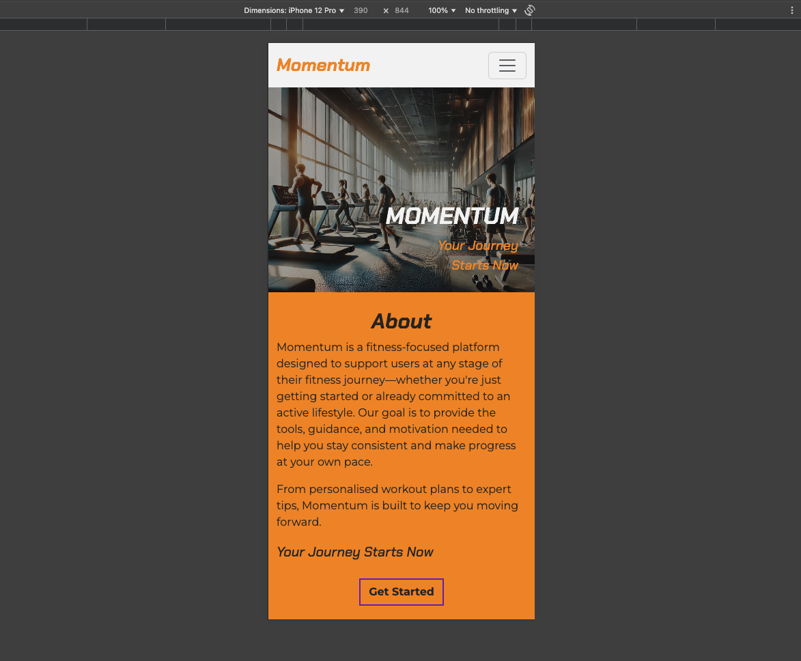
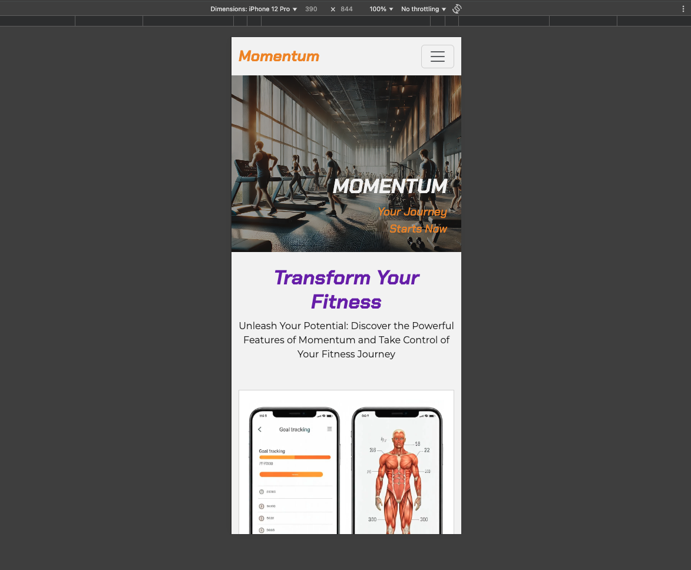
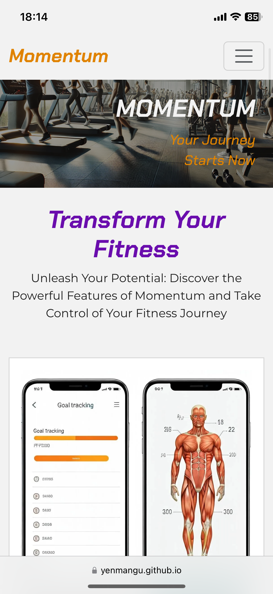
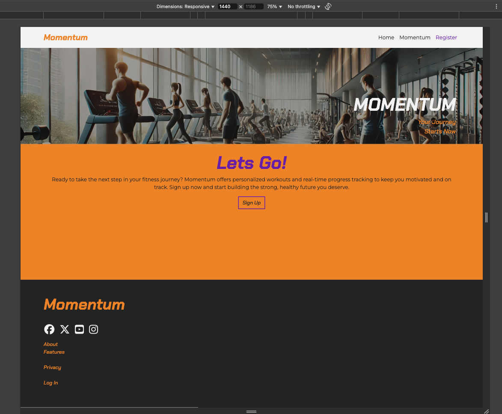
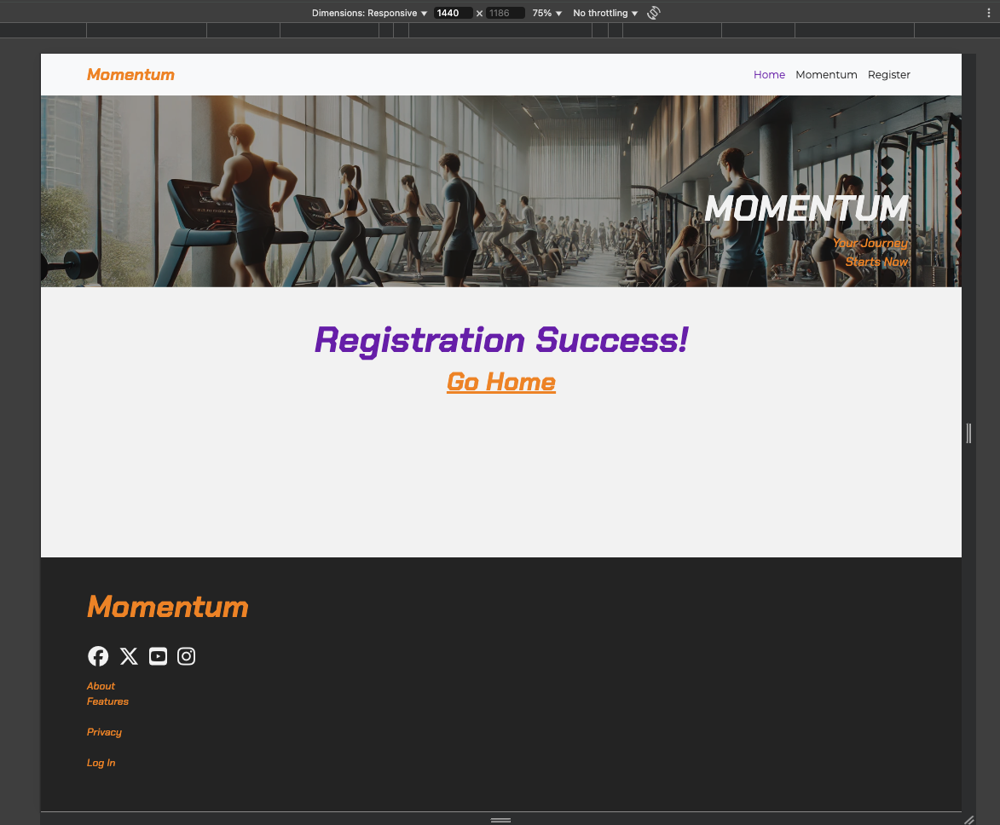
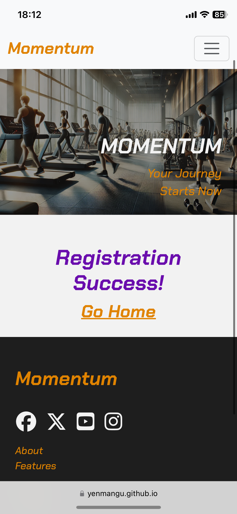
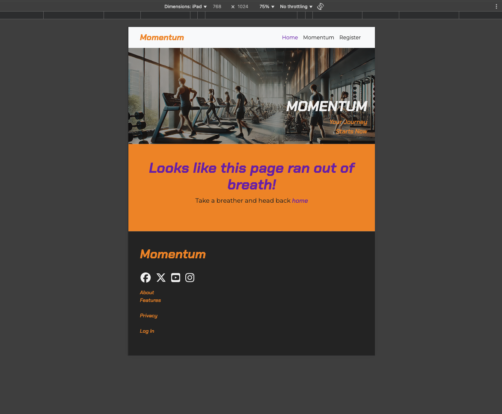

# Testing

> [!NOTE]
> Return back to the [README.md](README.md) file.

## Code Validation
### HTML

I have used the recommended [HTML W3C Validator](https://validator.w3.org) to validate all of my HTML files.

| Directory | File                                                                                                     | URL                                                                                                                 | Screenshot                                                             |
| --------- | -------------------------------------------------------------------------------------------------------- | ------------------------------------------------------------------------------------------------------------------- | ---------------------------------------------------------------------- |
|           | [404.html](https://github.com/yenmangu/ci-momentum/blob/main/404.html)                                   | [HTML Validator](https://validator.w3.org/nu/?doc=https://yenmangu.github.io/ci-momentum/404.html)                  |                   |
|           | [fitness-registration.html](https://github.com/yenmangu/ci-momentum/blob/main/fitness-registration.html) | [HTML Validator](https://validator.w3.org/nu/?doc=https://yenmangu.github.io/ci-momentum/fitness-registration.html) |  |
|           | [index.html](https://github.com/yenmangu/ci-momentum/blob/main/index.html)                               | [HTML Validator](https://validator.w3.org/nu/?doc=https://yenmangu.github.io/ci-momentum/index.html)                |                 |
|           | [momentum.html](https://github.com/yenmangu/ci-momentum/blob/main/momentum.html)                         | [HTML Validator](https://validator.w3.org/nu/?doc=https://yenmangu.github.io/ci-momentum/momentum.html)             |              |
|           | [privacy.html](https://github.com/yenmangu/ci-momentum/blob/main/privacy.html)                           | [HTML Validator](https://validator.w3.org/nu/?doc=https://yenmangu.github.io/ci-momentum/privacy.html)              |               |
|           | [registration-success.html](https://github.com/yenmangu/ci-momentum/blob/main/registration-success.html) | [HTML Validator](https://validator.w3.org/nu/?doc=https://yenmangu.github.io/ci-momentum/registration-success.html) |  |

### CSS

I have used the recommended [CSS Jigsaw Validator](https://jigsaw.w3.org/css-validator) to validate all of my CSS files.

| Directory | File                                                                                | URL                                                                                                       | Screenshot                                                   |
| --------- | ----------------------------------------------------------------------------------- | --------------------------------------------------------------------------------------------------------- | ------------------------------------------------------------ |
| assets    | [style.css](https://github.com/yenmangu/ci-momentum/blob/main/assets/css/style.css) | [CSS Validator](https://jigsaw.w3.org/css-validator/validator?uri=https://yenmangu.github.io/ci-momentum) |  |

## Responsiveness

I've tested my deployed project to check for responsiveness issues. I have also tested on my own device, as

| Page         | Mobile                                                              | Tablet                                                              | Desktop                                                              | iPhone                                                              | Notes             |
| ------------ | ------------------------------------------------------------------- | ------------------------------------------------------------------- | -------------------------------------------------------------------- | ------------------------------------------------------------------- | ----------------- |
| Home         |          |          |          |          | Works as expected |
| Momentum     |      |      |      |      | Works as expected |
| Registration |  |  |  |  | Works as expected |
| Success      |       |       |       |       | Works as expected |
| 404          |           |           |           |           | Works as expected |

## Browser Compatibility

⚠️ INSTRUCTIONS ⚠️

Use this space to discuss testing the live/deployed site on various browsers. Consider testing at least 3 different browsers, if available on your system. You DO NOT need to use all of the browsers below, just pick any 3 (minimum).

Recommended browsers to consider:
- [Chrome](https://www.google.com/chrome)
- [Firefox (Developer Edition)](https://www.mozilla.org/firefox/developer)
- [Edge](https://www.microsoft.com/edge)
- [Safari](https://support.apple.com/downloads/safari)
- [Brave](https://brave.com/download)
- [Opera](https://www.opera.com/download)

**IMPORTANT**: You must provide screenshots of the browsers you've tested, to "prove" that you've actually tested them.

Please note, there are services out there that can test multiple browser compatibilities at the same time. Some of these are paid services, but some are free. If you use these, you must provide a link to the source used for attribution, and multiple screenshots of the results.

⚠️ --- END --- ⚠️

I've tested my deployed project on multiple browsers to check for compatibility issues.
<!-- YOU ARE HERE -->

| Page         | Chrome                                                        | Firefox                                                        | Safari                                                        | Notes             |
| ------------ | ------------------------------------------------------------- | -------------------------------------------------------------- | ------------------------------------------------------------- | ----------------- |
| Home         |          |          |          | Works as expected |
| Gallery      |       |       |       | Works as expected |
| Signup       |        |        |        | Works as expected |
| Confirmation |  |  |  | Works as expected |
| 404          |           |           |           | Works as expected |

## Lighthouse Audit

⚠️ INSTRUCTIONS ⚠️

Use this space to discuss testing the live/deployed site's Lighthouse Audit reports. Avoid testing the local version (Gitpod/VSCode/etc.), as this can have knock-on effects for performance. If you don't have "Lighthouse" in your Developer Tools, it can be added as an [extension](https://chrome.google.com/webstore/detail/lighthouse/blipmdconlkpinefehnmjammfjpmpbjk).

Unless your project is a single-page application (SPA), you should test Lighthouse Audit results for all of your pages, for both *mobile* and *desktop*.

**IMPORTANT**: You must provide screenshots of the results, to "prove" that you've actually tested them.

⚠️ --- END --- ⚠️

I've tested my deployed project using the Lighthouse Audit tool to check for any major issues. Some warnings are outside of my control, and mobile results tend to be lower than desktop.

| Page         | Mobile                                                          | Desktop                                                          |
| ------------ | --------------------------------------------------------------- | ---------------------------------------------------------------- |
| Home         |          |          |
| Gallery      |       |       |
| Signup       |        |        |
| Confirmation |  |  |
| 404          |           |           |

## Defensive Programming

⚠️ INSTRUCTIONS ⚠️

Defensive programming (defensive design) is extremely important! When building projects that accept user inputs or forms, you should always test the level of security for each form field. Examples of this could include (but not limited to):

All Projects:

- Users cannot submit an empty form (add the `required` attribute)
- Users must enter valid field types (ensure the correct input `type=""` is used)
- Users cannot brute-force a URL to navigate to a restricted pages

Python Projects:

- Users cannot perform CRUD functionality if not authenticated (if login functionality exists)
- User-A should not be able to manipulate data belonging to User-B, or vice versa
- Non-Authenticated users should not be able to access pages that require authentication
- Standard users should not be able to access pages intended for superusers/admins

You'll want to test all functionality on your application, whether it's a standard form, or CRUD functionality, for data manipulation on a database. Try to access various pages on your site as different user types (User-A, User-B, guest user, admin, superuser). You should include any manual tests performed, and the expected results/outcome.

Testing should be replicable (can someone else replicate the same outcome?). Ideally, tests cases should focus on each individual section of every page on the website. Each test case should be specific, objective, and step-wise replicable.

Instead of adding a general overview saying that everything works fine, consider documenting tests on each element of the page (eg. button clicks, input box validation, navigation links, etc.) by testing them in their "happy flow", their "bad/exception flow", mentioning the expected and observed results, and drawing a parallel between them where applicable.

Consider using the following format for manual test cases:

- Expected Outcome / Test Performed / Result Received / Fixes Implemented

- **Expected**: "Feature is expected to do X when the user does Y."
- **Testing**: "Tested the feature by doing Y."
- (either) **Result**: "The feature behaved as expected, and it did Y."
- (or) **Result**: "The feature did not respond to A, B, or C."
- **Fix**: "I did Z to the code because something was missing."

Use the table below as a basic start, and expand on it using the logic above.

⚠️ --- END --- ⚠️

Defensive programming was manually tested with the below user acceptance testing:

| Page               | Expectation                                                                                              | Test                                                                                                    | Result                                                                           | Screenshot                                             |
| ------------------ | -------------------------------------------------------------------------------------------------------- | ------------------------------------------------------------------------------------------------------- | -------------------------------------------------------------------------------- | ------------------------------------------------------ |
| Home               | Feature is expected to display examples of why users should join.                                        | Verified that the page displays the club’s mission and purpose in a clear and concise manner.           | The mission and purpose were displayed as expected.                              |         |
|                    | Feature is expected to have accessible navigation links.                                                 | Checked navigation links for correct functionality and accessibility.                                   | Navigation links were functional and accessible.                                 |   |
|                    | Feature is expected to be fully responsive.                                                              | Resized the browser window and tested on multiple devices (mobile, tablet, desktop).                    | The page was responsive across all tested screen sizes.                          |   |
| Schedule/Timetable | Feature is expected to show the running schedule/timetable for sessions.                                 | Confirmed that the page contains a structured table or list with session timings.                       | Timetable was displayed as expected.                                             |     |
| Events             | Feature is expected to display details of different running events.                                      | Verified that the page lists upcoming events with relevant details.                                     | Event details were displayed as expected.                                        |       |
| Gallery            | Feature is expected to showcase a gallery of past events.                                                | Verified that the gallery contains clear images that aren't stretched, pixelated, and fully responsive. | Images are properly sized, and respond well to different device sizes.           |      |
| Sign-Up Form       | Feature is expected to prevent submission of an empty form.                                              | Attempted to submit the form without filling any fields.                                                | Form submission was blocked, as expected.                                        |     |
|                    | Feature is expected to enforce valid input types for each field.                                         | Entered invalid data (e.g., random text in an email field, numbers in a name field, etc.).              | Error messages were displayed appropriately, and submission was blocked.         |     |
| Social Links       | Feature is expected to include working links to the club’s social platforms (Instagram, Facebook, etc.). | Clicked each social link to verify redirection to the correct platform page.                            | All links redirected to the correct platform pages, opening in new browser tabs. |  |
| 404 Error Page     | Feature is expected to display a 404 error page for non-existent pages.                                  | Navigated to an invalid URL (e.g., `/test`) to test error handling.                                     | A custom 404 error page was displayed as expected.                               |          |

## User Story Testing

⚠️ INSTRUCTIONS ⚠️

Testing User Stories is actually quite simple, once you've already got the stories defined on your README.

Most of your project's **Features** should already align with the **User Stories**, so this should be as simple as creating a table with the User Story, matching with the re-used screenshot from the respective Feature.

⚠️ --- END --- ⚠️

| Target    | Expectation                                                                               | Outcome                                                                                 | Screenshot                                          |
| --------- | ----------------------------------------------------------------------------------------- | --------------------------------------------------------------------------------------- | --------------------------------------------------- |
| As a user | I would like to see examples of why I should join                                         | so that I can learn about the club’s mission and purpose before deciding to join.       |  |
| As a user | I would like to view the running schedule/timetable                                       | so that I can decide when to join a session.                                            |  |
| As a user | I would like to see the details of different running events                               | so that I can prepare accordingly.                                                      |  |
| As a user | I would like to view a gallery of past events                                             | so that I can see photos of myself and others from previous runs.                       |  |
| As a user | I would like to sign up for the running club                                              | so that I can join the community and participate in events.                             |  |
| As a user | I would like to follow the club on various platforms (e.g., Instagram, Facebook, Twitter) | so that I can stay updated with club news and events.                                   |  |
| As a user | I would like the website to be fully responsive                                           | so that I can easily navigate and access information from my phone, tablet, or desktop. |  |
| As a user | I would like to see a 404 error page if I get lost                                        | so that it's obvious that I've stumbled upon a page that doesn't exist.                 |  |

## Bugs

⚠️ INSTRUCTIONS ⚠️

Nobody likes bugs,... except the assessors! Projects seem more suspicious if a student doesn't properly track their bugs. If you're about to submit your project without any bugs listed below, you should ask yourself why you're doing this course in the first place, if you're able to build this entire application without running into any bugs. The best thing you can do for any project is to document your bugs! Not only does it show the true stages of development, but think of it as breadcrumbs for yourself in the future, should you encounter the same/similar bug again, it acts as a gentle reminder on what you did to fix the bug.

If/when you encounter bugs during the development stages of your project, you should document them here, ideally with a screenshot explaining what the issue was, and what you did to fix the bug.

Alternatively, an improved way to manage bugs is to use the built-in **[Issues](https://www.github.com/yenmangu/ci-momentum/issues)** tracker on your GitHub repository. This can be found at the top of your repository, the tab called "Issues".

If using the Issues tracker for bug management, you can simplify the documentation process for testing. Issues allow you to directly paste screenshots into the issue page without having to first save the screenshot locally. You can add labels to your issues (e.g. `bug`), assign yourself as the owner, and add comments/updates as you progress with fixing the issue(s). Once you've solved the issue/bug, you should then "Close" it.

When showcasing your bug tracking for assessment, you can use the following examples below.

⚠️ --- END --- ⚠️

### Fixed Bugs

I've used [GitHub Issues](https://www.github.com/yenmangu/ci-momentum/issues) to track and manage bugs and issues during the development stages of my project.

All previously closed/fixed bugs can be tracked [here](https://www.github.com/yenmangu/ci-momentum/issues?q=is%3Aissue+is%3Aclosed+label%3Abug).

### Unfixed Bugs

⚠️ INSTRUCTIONS ⚠️

You will need to mention any unfixed bugs and why they are not fixed upon submission of your project. This section should include shortcomings of the frameworks or technologies used. Although time can be a big variable to consider, paucity of time and difficulty understanding implementation is not a valid reason to leave bugs unfixed. Where possible, you must fix all outstanding bugs, unless outside of your control.

If you've identified any unfixed bugs, no matter how small, be sure to list them here! It's better to be honest and list them, because if it's not documented and an assessor finds the issue, they need to know whether or not you're aware of them as well, and why you've not corrected/fixed them.

⚠️ --- END --- ⚠️

Any remaining open issues can be tracked [here](https://www.github.com/yenmangu/ci-momentum/issues).

### Known Issues

| Issue                                                                                                                             | Screenshot                                             |
| --------------------------------------------------------------------------------------------------------------------------------- | ------------------------------------------------------ |
| On devices smaller than 375px, the page starts to have horizontal `overflow-x` scrolling.                                         |        |
| When validating HTML with a semantic `<section>` element, the validator warns about lacking a header `h2-h6`. This is acceptable. |  |

> [!IMPORTANT]
> There are no remaining bugs that I am aware of, though, even after thorough testing, I cannot rule out the possibility.

