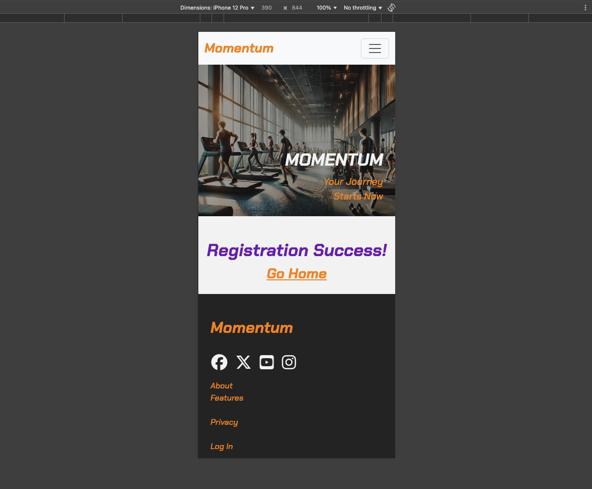
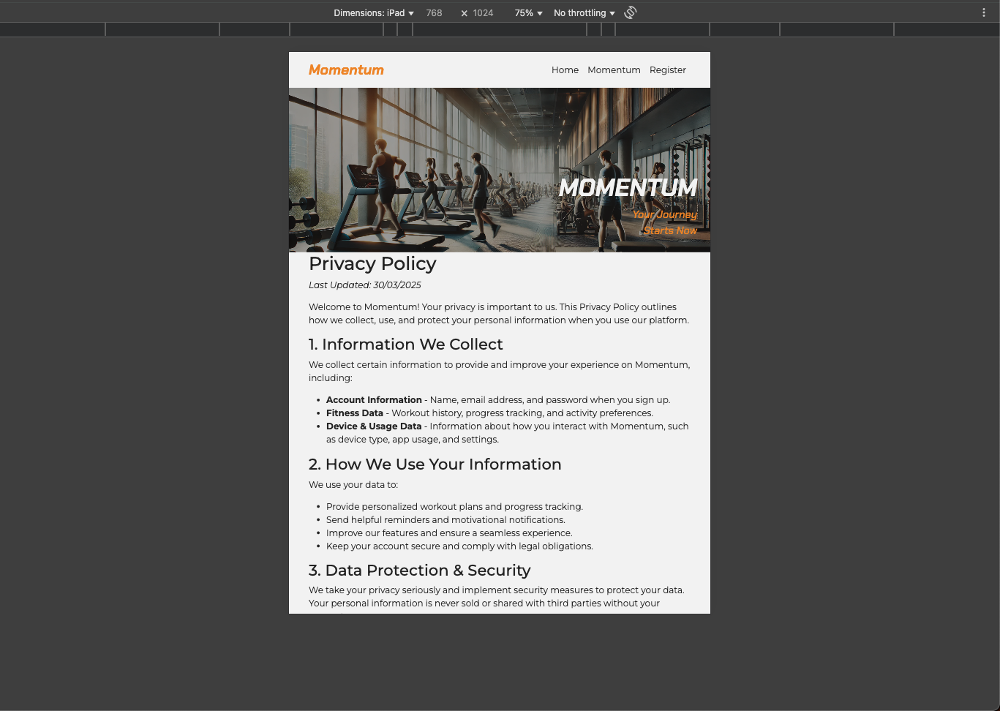

# Testing

> [!NOTE]
> Return back to the [README.md](README.md) file.

## Code Validation
### HTML

I have used the recommended [HTML W3C Validator](https://validator.w3.org) to validate all of my HTML files.

| Directory | File                                                                                                     | URL                                                                                                                 | Screenshot                                                             |
| --------- | -------------------------------------------------------------------------------------------------------- | ------------------------------------------------------------------------------------------------------------------- | ---------------------------------------------------------------------- |
|           | [404.html](https://github.com/yenmangu/ci-momentum/blob/main/404.html)                                   | [HTML Validator](https://validator.w3.org/nu/?doc=https://yenmangu.github.io/ci-momentum/404.html)                  |                   |
|           | [fitness-registration.html](https://github.com/yenmangu/ci-momentum/blob/main/fitness-registration.html) | [HTML Validator](https://validator.w3.org/nu/?doc=https://yenmangu.github.io/ci-momentum/fitness-registration.html) |  |
|           | [index.html](https://github.com/yenmangu/ci-momentum/blob/main/index.html)                               | [HTML Validator](https://validator.w3.org/nu/?doc=https://yenmangu.github.io/ci-momentum/index.html)                |                 |
|           | [momentum.html](https://github.com/yenmangu/ci-momentum/blob/main/momentum.html)                         | [HTML Validator](https://validator.w3.org/nu/?doc=https://yenmangu.github.io/ci-momentum/momentum.html)             |              |
|           | [privacy.html](https://github.com/yenmangu/ci-momentum/blob/main/privacy.html)                           | [HTML Validator](https://validator.w3.org/nu/?doc=https://yenmangu.github.io/ci-momentum/privacy.html)              |               |
|           | [registration-success.html](https://github.com/yenmangu/ci-momentum/blob/main/registration-success.html) | [HTML Validator](https://validator.w3.org/nu/?doc=https://yenmangu.github.io/ci-momentum/registration-success.html) |  |

### CSS

I have used the recommended [CSS Jigsaw Validator](https://jigsaw.w3.org/css-validator) to validate all of my CSS files.

| Directory | File                                                                                | URL                                                                                                       | Screenshot                                                   |
| --------- | ----------------------------------------------------------------------------------- | --------------------------------------------------------------------------------------------------------- | ------------------------------------------------------------ |
| assets    | [style.css](https://github.com/yenmangu/ci-momentum/blob/main/assets/css/style.css) | [CSS Validator](https://jigsaw.w3.org/css-validator/validator?uri=https://yenmangu.github.io/ci-momentum) |  |

## Responsiveness

I've tested my deployed project to check for responsiveness issues. I have also tested on my own device, as

| Page         | Mobile                                                              | Tablet                                                              | Desktop                                                              | iPhone                                                              | Notes             |
| ------------ | ------------------------------------------------------------------- | ------------------------------------------------------------------- | -------------------------------------------------------------------- | ------------------------------------------------------------------- | ----------------- |
| Home         |          |          |          |          | Works as expected |
| Momentum     |      |      |      |      | Works as expected |
| Registration |  |  |  |  | Works as expected |
| Success      |       |       |       |       | Works as expected |
| 404          |           |           |           |           | Works as expected |
| Privacy      |       |       |       |       | Works as expected |

## Browser Compatibility

I've tested my deployed project on multiple browsers to check for compatibility issues.

| Page         | Chrome                                                        | Opera                                                        | Safari                                                        | Notes             |
| ------------ | ------------------------------------------------------------- | ------------------------------------------------------------ | ------------------------------------------------------------- | ----------------- |
| Home         |          |          |          | Works as expected |
| Mmomentum    |      |      |      | Works as expected |
| Registration |  |  |  | Works as expected |
| Success      |       |       |       | Works as expected |
| 404          |           |           |           | Works as expected |
| Privacy      |       |       |       | Works as expected |

## Lighthouse Audit

I've tested my deployed project using the Lighthouse Audit tool to check for any major issues. Some warnings are outside of my control, and mobile results tend to be lower than desktop.

| Page         | Mobile                                                                  | Desktop                                                                  |
| ------------ | ----------------------------------------------------------------------- | ------------------------------------------------------------------------ |
| Home         |                  |                  |
| Momentum     |              |              |
| Registration |          |          |
| Success      |  |  |
| 404          |                   |                   |
| Privacy      |               |               |

## Defensive Programming

Defensive programming was manually tested with the below user acceptance testing:

| Page/ Feature     | Expectation                                                                                              | Test                                                                                   | Result                                                                               | Screenshot                                                                                                   | Fix (if needed) |
| ----------------- | -------------------------------------------------------------------------------------------------------- | -------------------------------------------------------------------------------------- | ------------------------------------------------------------------------------------ | ------------------------------------------------------------------------------------------------------------ | --------------- |
| Navigation        | Expected to provide clear and accessible navigation links                                                | Verified that navigation links are clear and accessible                                | Navigation links appear and operate as expected                                      |                                                         |                 |
|                   | Expected to be responsive across mutiple device sizes with mobile menu                                   | Test navigation menu across multiple screen sizes                                      | Navigation menu responsive as expected. Mobile menu shows at expected device widths. |                                                 |                 |
| Home              | Expected to give user overview of the platform                                                           | Verified that page displays platform's mission and purpose in clear and concise manner | Mission and purpose displayed as expected                                            |                                                               |                 |
|                   | Feature expected to be fully responsive                                                                  | Resized browser window and tested on multiple devices (mobile, tablet, desktop).       | Page was responsive across all tested screen sizes                                   | See [Responsiveness](#responsiveness)                                                                        |                 |
|                   | Expected to give user testimonials                                                                       | Verified user testimonials displayed in clear and readable manner.                     | Testimonials displayed as expected                                                   |                                                       |                 |
| Momentum          | Expected to showcase the features of the platform                                                        | Verified features of platform displayed in clear and concise manner                    | Features of platform displayed as expected                                           |                                                           |                 |
| Registration      | Expected to have clear CTA for user registration                                                         | Verified CTA is clear and attractive                                                   | CTA is clear and attractive                                                          |                                                   |                 |
| Registration Form | Expected to enforce valid input type for email field                                                     | Entered invalid data into email field                                                  | Error message displayed appropriately                                                |                                                       |                 |
|                   | Expected to have enforce required fields, and prevent submission of empty form                           | Attempt to submit empty fields                                                         | Navigation links functional and accessible                                           | , |                 |
| Social Links      | Feature is expected to include working links to the club’s social platforms (Instagram, Facebook, etc.). | Clicked each social link to verify redirection to the correct platform page.           | All links redirected to the correct platform pages, opening in new browser tabs.     |                                                       |                 |
| 404 Error Page    | Feature is expected to display a 404 error page for non-existent pages.                                  | Navigated to an invalid URL (e.g., `/test`) to test error handling.                    | A custom 404 error page was displayed as expected.                                   |                                                                |                 |

## Implemented User Story Testing

| Target    | Expectation                                                                                   | Outcome                                                                                 | Screenshot                                             |
| --------- | --------------------------------------------------------------------------------------------- | --------------------------------------------------------------------------------------- | ------------------------------------------------------ |
| As a user | I would like to know more about the platform                                                  | so that I can start my fitness journey                                                  |         |
| As a user | I would like to see the details of a fitness platform features                                | so that I can choose my fitness app accordingly                                         |      |
| As a user | I would like to sign up for a fitness platform                                                | so that I can use the app and enjoy its benefits.                                       |  |
| As a user | I would like to follow the platform on various platforms (e.g., Instagram, Facebook, Twitter) | so that I can stay updated with platform news and events.                               |  |
| As a user | I would like the website to be fully responsive                                               | so that I can easily navigate and access information from my phone, tablet, or desktop. | [See responsiveness](#responsiveness)                  |
| As a user | I would like to see a 404 error page if I get lost                                            | so that it's obvious that I've stumbled upon a page that doesn't exist.                 |           |

## Bugs

### Fixed Bugs

I've used [GitHub Issues](https://www.github.com/yenmangu/ci-momentum/issues) to track and manage bugs and issues during the development stages of my project.

All previously closed/fixed bugs can be tracked [here](https://www.github.com/yenmangu/ci-momentum/issues?q=is%3Aissue+is%3Aclosed+label%3Abug).

### Unfixed Bugs

Any remaining open issues can be tracked [here](https://www.github.com/yenmangu/ci-momentum/issues).

### Known Issues

> [!IMPORTANT]
> There are no remaining bugs that I am aware of, though, even after thorough testing, I cannot rule out the possibility.

